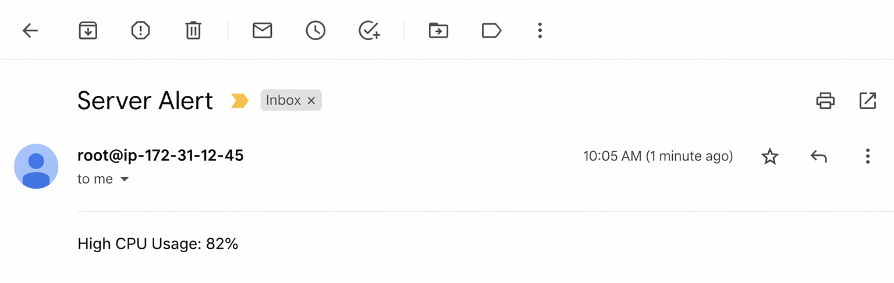

# 🚀 Server Health Monitoring & Alert System (Bash)

## 📌 Project Overview

This project is a **production-style server monitoring system** built using **Bash scripting**. It continuously monitors system health metrics and sends alerts when thresholds are exceeded.

The script is designed to simulate **real-world DevOps monitoring practices** such as logging, alerting, automation, and failure handling.

---

## 🎯 Features

* ✅ Monitor **CPU Usage**
* ✅ Monitor **Memory Usage**
* ✅ Monitor **Disk Usage**
* ✅ Check **critical services status**
* ✅ Send **email alerts**
* ✅ Maintain **daily logs**
* ✅ Automatic **log rotation**
* ✅ Runs via **cron job (automation)**
* ✅ Built-in **error handling & validation**

---

## 🏗️ Project Structure

```
Monitoring/
│── monitor.sh
│── config.sh
│── logs/
```

---

## ⚙️ Configuration

Edit the `config.sh` file to define thresholds and settings:

```bash
CPU_THRESHOLD=80
MEMORY_THRESHOLD=80
DISK_THRESHOLD=80

EMAIL="your-email@example.com"

SERVICES=("nginx" "docker")
```

---

## 🧠 How It Works

### 1. System Metrics Collection

* CPU usage using `top`
* Memory usage using `free`
* Disk usage using `df`

### 2. Logging

* Logs are stored in:

```
logs/monitor-YYYY-MM-DD.log
```

* Example log:

```
2026-04-21 10:00:01 hostname CPU:85% MEM:70% DISK:60%
```

---

### 3. Alerting System

* Sends alerts when:

  * CPU > threshold
  * Memory > threshold
  * Disk > threshold
  * Service is down

* Alerts are sent via **email**

---

---

### 4. Service Monitoring

Checks if critical services are running:

```bash
systemctl is-active nginx
systemctl is-active docker
```

---

### 5. Log Rotation

* Automatically deletes logs older than **7 days**

```bash
find logs/ -type f -mtime +7 -delete
```

---

### 6. Error Handling

* Script uses:

```bash
set -euo pipefail
```

* Trap for debugging:

```bash
trap 'echo "Script failed at line $LINENO"' ERR
```

---

## 🚀 Setup & Installation

### Step 1: Clone Repository

```bash
git clone <your-repo-url>
cd server-monitor
```

### Step 2: Give Permission

```bash
chmod +x monitor.sh config.sh
```

### Step 3: Install Dependencies

```bash
sudo apt update
sudo apt install mailutils -y
```

---

## ▶️ Run Script

```bash
./config.sh
./monitor.sh
```

---

## ⏰ Automate with Cron

Edit crontab:

```bash
crontab -e
```

daily 12pm :

```bash
0 12 * * * /path/to/server-monitor/monitor.sh
```
---

## 👨‍💻 Author

**Akash Kayande** *DevOps | AWS | Terraform | Kubernetes*

---

## ⭐ If you like this project

Give it a star on GitHub ⭐
