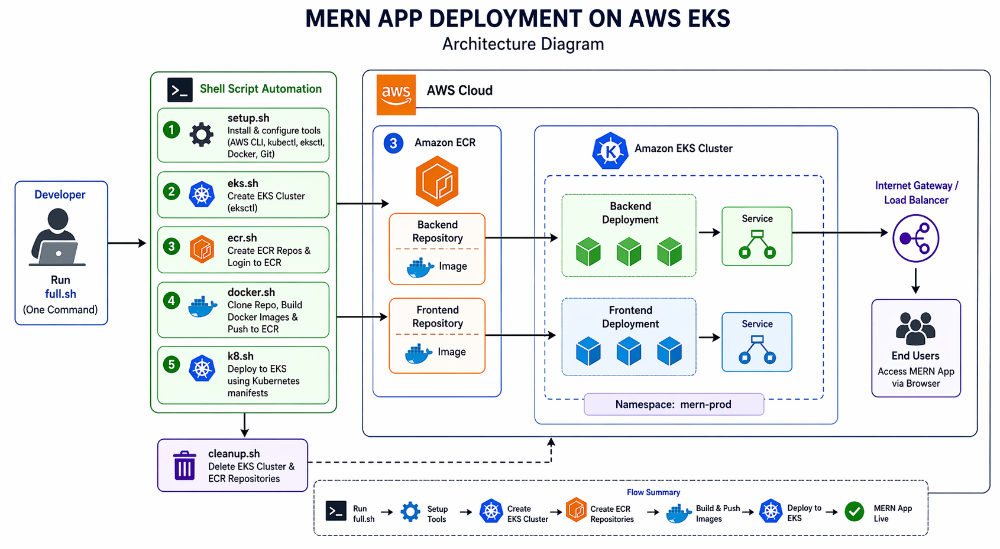

# 🚀 MERN App Deployment on AWS EKS using Shell Scripting

This project automates the end-to-end deployment of a **MERN (MongoDB, Express, React, Node.js)** application on an **AWS EKS (Elastic Kubernetes Service)** cluster using **pure shell scripting**.

It provisions infrastructure, builds Docker images, pushes them to AWS ECR, and deploys the application to Kubernetes — all with a single command.

---

## 📌 Project Overview

This project demonstrates:

* Automated AWS CLI configuration
* EKS cluster provisioning using `eksctl`
* Docker image build & push to ECR
* Kubernetes deployment using manifests
* Namespace management
* Fully automated deployment pipeline via shell scripts

---

---

## 🏗️ Project Structure

```

├── .env
├── config/
│   └── config.sh
├── scripts/
|   ├── full.sh
│   ├── setup.sh
│   ├── config.sh
│   ├── eks.sh
│   ├── ecr.sh
│   ├── docker.sh
│   ├── k8.sh
│   └── cleanup.sh
```

---

## ⚙️ Prerequisites

Before running the project, ensure:

* Ubuntu/Linux system
* AWS account
* IAM user with required permissions (EKS, ECR, EC2)
* `.env` file with credentials

---

## 🔐 Environment Variables (`.env`)

Create a `.env` file in root:

```env
AWS_ACCESS_KEY_ID=your_access_key
AWS_SECRET_ACCESS_KEY=your_secret_key
AWS_REGION=ap-south-1
```

---

## 🚀 One-Click Deployment

Run the following command:

```bash
bash full.sh
```

---

## 🔄 What Happens Internally?

### 1️⃣ Setup (`setup.sh`)

* Installs required tools if not present :

  * AWS CLI
  * kubectl
  * eksctl
  * Docker
* Configures AWS CLI using `.env`

---

### 2️⃣ EKS Cluster (`eks.sh`)

* Creates EKS cluster (if not exists)
* Configures kubeconfig
* Verifies nodes

---

### 3️⃣ ECR Setup (`ecr.sh`)

* Creates backend & frontend repositories
* Logs into ECR

---

### 4️⃣ Docker Build & Push (`docker.sh`)

* Clones MERN app repo
* Builds images:

  * Backend
  * Frontend
* Tags & pushes images to ECR

---

### 5️⃣ Kubernetes Deployment (`k8.sh`)

* Updates image tags dynamically using `sed`
* Creates namespace (if not exists)
* Applies Kubernetes manifests
* Verifies pods & services

---

## 📦 Deployment Output

After successful deployment:

```bash
kubectl get pods -n mern-prod
kubectl get svc -n mern-prod
```

---

## 🧹 Cleanup Resources

To delete everything:

```bash
cd scripts
bash cleanup.sh
```

This will:

* Delete EKS cluster
* Delete ECR repositories

---


## 🤝 Contribution

Feel free to fork and improve this project.

---

## 👨‍💻 Author

**Akash Kayande** *DevOps | AWS | Terraform | Kubernetes*

---

## ⭐ If you like this project

Give it a star on GitHub ⭐